# 🎙️ Intervux AI

<div align="center">


<br />


</div>

<div align="center">
  <h3>The World's First "Double-Sided" AI Interviewer</h3>
  <p>
    <strong>Intervux AI</strong> is a real-time platform that sees your face, hears your voice, evaluates your code, and reacts through a responsive 3D avatar.
  </p>
</div>

---

## 🧠 The Problem
Hiring and interview preparation today is **fundamentally broken**:
* **Static & unrealistic:** Mock interviews don’t simulate real pressure.
* **Text-only:** Chatbots don’t observe non-verbal signals or interruptions.
* **Incomplete Data:** Candidates are evaluated only on answers, not delivery, hesitation, or behavior.

**Real interviews are multimodal. Most tools are not.**

## 💡 The Solution: Intervux AI
Intervux is a **real-time simulation platform** that replicates how **human interviewers actually evaluate candidates**. It goes beyond simple Q&A by acting as a **"Double-Sided" Partner**:

1.  👁️ **It Sees:** Parses resumes visually using Vision-Language Models (Agent OCR-RAG).
2.  🎧 **It Hears:** Supports full-duplex audio, allowing you to interrupt the AI naturally.
3.  😰 **It Feels:** Detects micro-expressions (nervousness, confidence) via Computer Vision.
4.  💻 **It Judges:** Reviews code logic, syntax, and time complexity in real-time.

---

## ✨ Core Features

| Feature | Description |
| :--- | :--- |
| **🗣️ Real-Time Audio** | Streaming audio pipeline with **Voice Activity Detection (VAD)** for natural, interruptible conversation. |
| **🎭 3D Avatar** | High-fidelity **Three.js / React Three Fiber** avatar with real-time lip-sync (viseme) animation. |
| **😰 Emotion AI** | **OpenCV + FER** based facial analysis to detect stress and dynamically adjust interview difficulty. |
| **💻 Live Sandbox** | Embedded **Monaco Editor** for coding interviews. The AI runs code safely and checks Big-O complexity. |
| **📄 Agent OCR** | Intelligent resume parsing using Vision Models to extract structure without raw text bloat. |
| **⚡ Low Latency** | Built on **WebSockets** and **FastAPI** for an event-driven architecture targeting <500ms response times. |

---

## 🧩 System Architecture

### High-Level Flow


### Real-Time Interaction Loop

```mermaid
sequenceDiagram
    participant User
    participant FE as React Frontend
    participant BE as FastAPI Backend
    participant AI as Gemini / STT / TTS
    participant CV as Emotion AI

    User->>FE: Speak / Code / Facial cues
    FE->>BE: audio_stream (PCM)
    BE->>AI: STT → Reasoning → TTS
    AI-->>BE: Audio + Visemes
    BE-->>FE: avatar_sync

    FE->>BE: video_frame
    BE->>CV: Emotion Detection
    CV-->>BE: Stress Score
    BE-->>FE: stress_update

```



---

## 🛠️ Tech Stack

### Frontend (Client)

* **Framework:** React + TypeScript (Vite)
* **3D Engine:** React Three Fiber (R3F) / Drei
* **Editor:** Monaco Editor (VS Code core)
* **Comms:** WebSockets (Socket.io-client), Web Audio API

### Backend (Server)

* **Framework:** FastAPI (Python 3.10+)
* **Concurrency:** AsyncIO
* **Comms:** Python-SocketIO
* **Processing:** OpenCV (Vision), PyDub (Audio)

### AI & Logic

* **Brain:** Google Gemini 1.5 Pro
* **Speech:** Google STT / TTS (or Deepgram for lower latency)
* **Resume:** Vision-based OCR

---

## 🚀 Getting Started

### Prerequisites

* Python 3.10+
* Node.js 18+
* Docker (Optional)
* Google Gemini API Key

### 1. Clone the Repository

```bash
git clone [https://github.com/YourUsername/intervux-ai.git](https://github.com/YourUsername/intervux-ai.git)
cd intervux-ai

```

### 2. Backend Setup

```bash
cd backend
python -m venv venv
# Windows: .\venv\Scripts\activate
# Mac/Linux: source venv/bin/activate

pip install -r requirements.txt

# Create .env file
echo "GOOGLE_API_KEY=your_key_here" > .env
echo "GROQ_API_KEY=your_key_here" >> .env

# Run Server
uvicorn main:app --reload

```

### 3. Frontend Setup

```bash
cd frontend
npm install
npm run dev

```

### 4. Running via Docker (Recommended)

```bash
docker-compose up --build

```

Access the application at `http://localhost:5173`.

---

## 📁 Project Structure

```text
intervux-ai/
├── backend/                # Python FastAPI Server
│   ├── main.py             # Entry point
│   ├── sockets/            # WebSocket event handlers
│   ├── core/               # LLM & Logic Engine
│   ├── services/           # Audio, Vision, Code Execution services
│   └── config/             # Environment variables
├── frontend/               # React Application
│   ├── src/
│   │   ├── components/     # 3D Avatar, Code Editor, Video Feed
│   │   ├── hooks/          # useSocket, useAudio
│   │   └── pages/          # Interview Room
├── Dockerfile              # Container definition
├── docker-compose.yaml     # Orchestration
└── README.md

```

---

## 🛣️ Roadmap

* [x] **Core:** Real-time WebSocket architecture
* [x] **Architecture:** Decoupled Frontend/Backend
* [x] **Integration:** Audio, Vision, and Coding pipelines active
* [ ] **Avatar:** Advanced facial micro-expressions
* [ ] **Performance:** Latency tuning (<300ms)
* [ ] **Features:** Post-interview feedback reports
* [ ] **Scale:** Multi-language support

---

## 🧠 Vision

**Intervux AI** aims to bridge the gap between human intuition and AI scalability.

1. **For Candidates:** A stress-free training ground to fail safely and improve.
2. **For Companies:** A preliminary screening tool that removes bias.
3. **For Research:** A platform to study human-AI interaction dynamics.

---

## 📜 License

Distributed under the MIT License. See `LICENSE` for more information.

<div align="center">
<sub>Built with ❤️ by Vishal Gorule</sub>
</div>