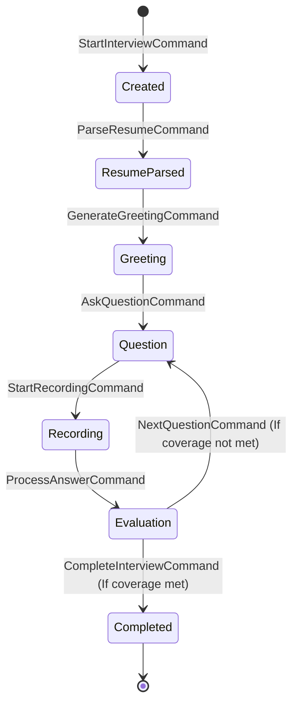

# Interview Lifecycle State Diagram

This document defines the strict lifecycle states of an Interview within the `InterviewAggregate`. An interview must flow through these states deterministically.

## State Definitions

- **Created**: The interview entity has been instantiated. The candidate is known, but no analysis has occurred.
- **ResumeParsed**: The Adaptive Engine has processed the candidate's resume and established the initial knowledge graph and topic coverage requirements.
- **Greeting**: The AI interviewer is delivering the initial introduction and setting context for the candidate.
- **Question**: The AI interviewer has delivered a specific question and is waiting for the candidate to begin answering.
- **Recording**: The candidate is actively speaking. Audio/Viseme streams are being processed in real-time.
- **Evaluation**: The candidate's answer has been submitted to the AI for grading and coverage analysis. The engine decides the next step based on the result.
- **Completed**: The interview has concluded. The final report is generated. No further state mutations are permitted.
